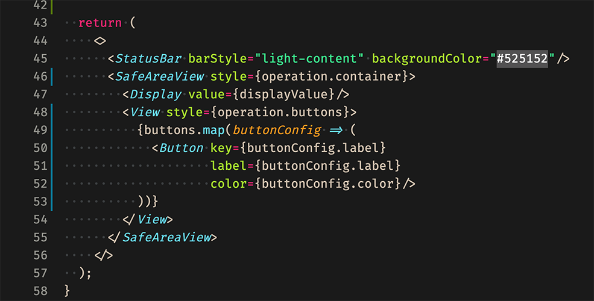

<div align="center">
      
</div>

# Monokai Dark Green for [Visual Studio Code](https://code.visualstudio.com)
A simple VSCode dark theme based on Monokai, replacing that yellow color by a green one!

If you like this theme, don't forget to leave a star at [Github](https://github.com/AlvaroIsrael/monokai-dark-green).

# ScreenShot


# History
I just did not like the Monokai's orignal yellish look of the strings. But I also loved the rest of the theme. I use a lot of strings in my code and that yellow color just pissed me off a lot! I really have no idea why.
Then I have decided to chage it from yellow to green (which is my second favorite color). Then I made this dark theme so others, also annoyed by taht yellow color, could also benefit from it.

I have taken the files structure to maintain this project from [Dracula](https://github.com/dracula/visual-studio-code/) after participating on a youtube live with the creator of that amazing theme.

I also wanted to give the proper credit to [Monokai-ST3-theme-for-vscode](https://github.com/volosovich/Monokai-ST3-theme-for-vscode). I have used that theme as an inspiration to tweak and build my own.

# Docs & Contribution
To start using your extension with Visual Studio Code you can simply copy the folder "theme" with the .jsons into one of those folders below

```
Windows %USERPROFILE%\.vscode\extensions
macOS ~/.vscode/extensions
Linux ~/.vscode/extensions
```

Rename the "theme" folder with a more descritive name, like 'monokai-dark-green', restart VSCode and select the Monokai Dark Green from the menu.

or

You can also build your own .vsix extension. Just download the dependencies in package.json using npm:

```
cd monokai-dark-green
mkdir bin
npm install
```

After that if you would like to play around with new colors, feel free to fork it and edit the colors in the monokai-dark-green.yml.
Once you feel like testing it, just run the script build with:

```
npm run package
```

Your new theme should be avaliable inside ./bin folder to be installed in vscode.

PS.: Note this theme can also be downloaded and installed from the [Visual Studio Marketplace](https://marketplace.visualstudio.com/items?itemName=alvaro-israel-nunes-leite.theme-monokai-dark-green).

# Font & Icons
This is just a color theme, this does not include a font nor icons but I can recommend my favorites:

- [FiraCode](https://github.com/tonsky/FiraCode) a very neat and free font with ligatures for coders.
- [Material Icon Theme](https://github.com/PKief/vscode-material-icon-theme) my personal choice for icons.

# Changelog
[CHANGELOG.MD](CHANGELOG.md)

# License
This project is under MIT License. See [LICENSE](LICENSE.md) for more details.

Made with ❤️ by Alvaro Israel 👏🏻 [Get in touch!](https://www.linkedin.com/in/alvaroisraeldesenvolvedor/)
**Enjoy!**
