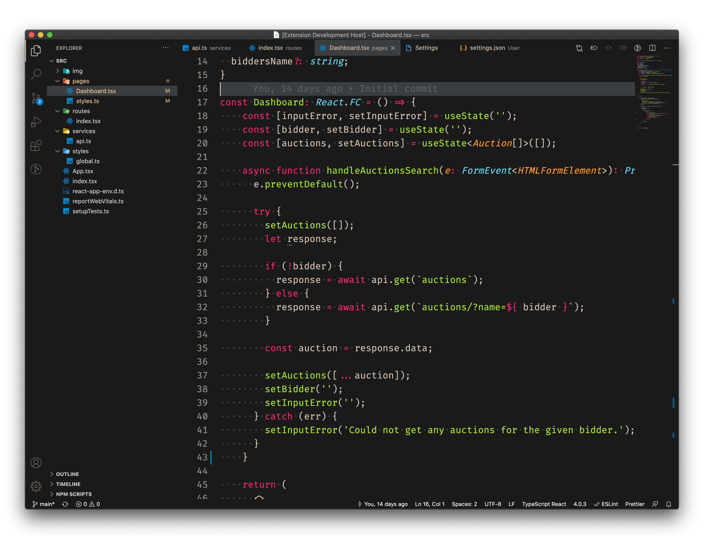

# Monokai Dark Green for [Visual Studio Code](http://code.visualstudio.com)
A simple VSCode dark theme based on Monokai, replacing that annoying yellow color with a green one! [Visual Studio Code](http://code.visualstudio.com).

# History
I just hated the Monokai's orignal yellish look of the strings. But I also loved the rest of the theme. I usually used a lot of strings in my code and that yellow color just pissed me off a lot! I really have no idea why.
Then I decided to change it to green (which is my second favorite color) and made this dark theme so others also annoyed by the yellow color could also benefit from it.

I have taken the files structure to maintain this project from [Dracula](https://github.com/dracula/visual-studio-code/) after participating on a youtube live with the creator of that amazing theme.

I also wanted to give the proper credit to [Monokai-ST3-theme-for-vscode](https://github.com/volosovich/Monokai-ST3-theme-for-vscode). I used that theme as an inspiration to tweak and build my own.

# Docs & Contribution
To start using your extension with Visual Studio Code you can simply copy the folder "theme" with the .jsons into the `<user home>/.vscode/extensions` folder, rename the folder with a more descritive name, like 'monokai-dark-green' and restart VSCode and select the theme from the menu.

or

You can also build your own .vsix extension. Just download the dependencies in package.json using npm

```
cd monokai-dark-green
mkdir bin
npm install
```

After that if you would like to play around with new colors, feel free to fork it (don't forget to give my theme a star before you do so) and edit the colors in the monokai-dark-green.yml. Once you feel like testing it just run the script build with:

```
npm run package
```

Your new theme should be avaliable inside ./bin folder to be installed in vscode.


# Changelog
[CHANGELOG.MD](CHANGELOG.md)

# ScreenShot


## :memo: License

This project is under MIT License. See [LICENSE](./LICENSE.md) for more details.

**Enjoy!**
